<div align="center">

# Decision Wheel

Spin a fully customizable decision wheel with your own options, colors, and messages. Share any configuration with a single bookmark link.

[![Live][badge-site]][url-site]
[![HTML5][badge-html]][url-html]
[![CSS3][badge-css]][url-css]
[![JavaScript][badge-js]][url-js]
[![Claude Code][badge-claude]][url-claude]
[![License][badge-license]](LICENSE)

[badge-site]:    https://img.shields.io/badge/live_site-0063e5?style=for-the-badge&logo=googlechrome&logoColor=white
[badge-html]:    https://img.shields.io/badge/HTML5-E34F26?style=for-the-badge&logo=html5&logoColor=white
[badge-css]:     https://img.shields.io/badge/CSS3-1572B6?style=for-the-badge&logo=css3&logoColor=white
[badge-js]:      https://img.shields.io/badge/JavaScript-F7DF1E?style=for-the-badge&logo=javascript&logoColor=black
[badge-claude]:  https://img.shields.io/badge/Claude_Code-CC785C?style=for-the-badge&logo=anthropic&logoColor=white
[badge-license]: https://img.shields.io/badge/license-MIT-404040?style=for-the-badge

[url-site]:   https://decisionwheel.neorgon.com/
[url-html]:   #
[url-css]:    #
[url-js]:     #
[url-claude]: https://claude.ai/code

</div>

---

A fully customizable decision wheel. Add your own options, icons, and messages — then save and share your configuration via a bookmark link.

**Live:** [decisionwheel.neorgon.com](https://decisionwheel.neorgon.com/) · runs entirely in the browser, no build step, no backend.

---

## What it does

Spin a randomized wheel to pick between any set of options you define. Comes pre-loaded with a food picker, but every part is configurable.

---

## Features

- **Customizable options** — add, remove, and reorder segments with any text, emoji, and color
- **Per-option messages** — set a custom message shown when a specific option lands (e.g. "Taco Tuesday! 🌮")
- **Default result template** — global message with `{result}` and `{emoji}` placeholders
- **Wheel title & icon** — name your wheel and set a header emoji
- **Live preview** — the wheel updates as you type in the settings panel
- **Settings saved automatically** — your configuration persists in `localStorage` across visits
- **Shareable link** — "Copy Share Link" encodes your full config into the URL hash; anyone opening it sees your exact wheel
- **Bookmark-friendly** — the URL hash updates whenever you apply settings, so bookmarking saves your wheel
- **Smooth animation** — ease-out quartic spin over 4–5 seconds with a confetti burst on result
- **Mobile-friendly** — settings panel becomes a full-screen drawer on small screens

---

## Settings

Open the **⚙️ Settings** panel in the header to configure:

| Field | Description |
|-------|-------------|
| Wheel Icon | Emoji displayed next to the title |
| Wheel Title | Name shown in the header and on the page |
| Result Message | Template shown after the wheel stops (`{result}`, `{emoji}`) |
| Options | Each has an emoji, label text, color, and optional custom message |

Click **Apply & Save** to persist and update the bookmark URL.

---

## Sharing & bookmarks

Every wheel configuration is encoded into the URL hash:

```
https://wheel.neorgon.com/#c=eyJ0aXRsZSI6...
```

Clicking **Copy Share Link** puts this URL on your clipboard. Anyone who opens it — or who bookmarks it — will see the same wheel with the same options.

---

## Architecture



```
dynamic-wheel-game/
├── index.html    # App shell
├── css/
│   └── style.css # All styles
└── js/
    ├── app.js    # Entry point
    ├── state.js  # Config, localStorage, URL hash serialization
    ├── wheel.js  # Canvas spin physics + winner detection
    ├── render.js # DOM updates
    ├── events.js # Spin + settings panel
    └── utils.js  # Helpers
```

---

## Running locally

```bash
cd dynamic-wheel-game
python3 -m http.server 8080
# open http://localhost:8080
```

Or open `index.html` directly — no dependencies, no install.

---

## Tech

Pure HTML + CSS + Canvas API + JavaScript. No external libraries. Wheel rendering uses `CanvasRenderingContext2D` arcs with ease-out quartic animation via `requestAnimationFrame`. Config serialized with `JSON.stringify` → `btoa` → URL hash.

---

<div align="center">
  <sub>Part of <a href="https://neorgon.com">Neorgon</a></sub>
</div>
